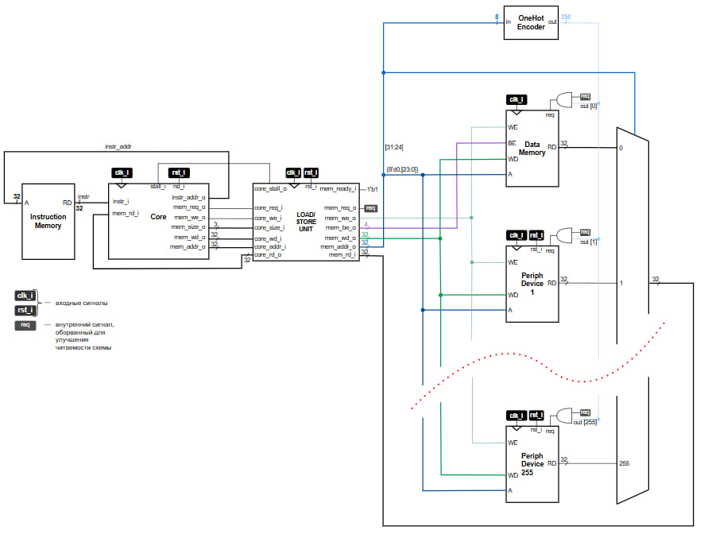

# RISC-V Processor System on FPGA


Учебный проект по разработке 32-битной процессорной системы на базе **RISC-V** на языке **SystemVerilog** с поддержкой памяти, memory-mapped периферии, CSR и обработки прерываний.

Проект представляет собой не отдельный ALU или набор разрозненных модулей, а **целостную SoC-систему**: процессорное ядро, память инструкций и данных, блок загрузки/сохранения, контроллер прерываний, CSR-подсистема и периферийные устройства, подключенные через общее адресное пространство.

## Возможности проекта

- 32-битное процессорное ядро на базе подмножества **RISC-V RV32I**
- Поддержка арифметико-логических операций, переходов, ветвлений, загрузки и записи данных
- Поддержка **CSR-инструкций** и обработки `mret`
- Обработка исключения для некорректной инструкции
- Обработка внешних прерываний
- Память инструкций и память данных с инициализацией из `.mem` файлов
- Блок **LSU (Load/Store Unit)** с формированием byte enable и поддержкой `LB/LH/LW/LBU/LHU`, `SB/SH/SW`
- **Memory-mapped периферия**
- Управление светодиодами и чтение состояния переключателей
- Подготовленная основа под PS/2-периферию
- Пример встроенной программы на **C/C++** для работы с периферией и прерываниями

## Текущий статус

На текущем этапе в системе уже реализованы и подключены:

- процессорное ядро
- память инструкций
- память данных
- LSU
- CSR-контроллер
- контроллер прерываний
- блок переключателей (`SW`)
- блок светодиодов (`LED`)

В проекте также присутствуют заготовки и интерфейсные точки расширения под:

- **PS/2-клавиатуру**
- **UART**
- **VGA**
- дополнительные memory-mapped устройства

> Важно: **клавиатура сейчас не подключена в итоговую конфигурацию системы и находится в разработке**.  
> Модули под PS/2 уже присутствуют в репозитории, но в текущем top-level они не используются как завершённая функциональность.

## Архитектура системы

Общая идея проекта:

1. `processor_core` выполняет инструкции и формирует запросы на доступ к памяти/периферии.
2. `lsu` преобразует обращения ядра в формат системной шины памяти: адрес, данные, byte enable, признак записи.
3. `processor_system` маршрутизирует обращения по старшему байту адреса в память данных или периферию.
4. `instr_mem` выдает инструкции из файла `init.mem`.
5. `data_mem` хранит данные программы и инициализируется из `init_data.mem`.
6. `sw_sb_ctrl` и `led_sb_ctrl` реализуют memory-mapped интерфейс для FPGA-платы.
7. `interrupt_controller` и `csr_controller` обеспечивают базовую поддержку trap/interrupt механизма.

## Поддерживаемые группы инструкций

По декодеру и исполнительным блокам в проекте реализована поддержка основных групп инструкций:

- **Load**: `LB`, `LH`, `LW`, `LBU`, `LHU`
- **Store**: `SB`, `SH`, `SW`
- **Immediate ALU**: `ADDI`, `XORI`, `ORI`, `ANDI`, `SLLI`, `SRLI`, `SRAI`, `SLTI`, `SLTIU`
- **Register ALU**: `ADD`, `SUB`, `XOR`, `OR`, `AND`, `SLL`, `SRL`, `SRA`, `SLT`, `SLTU`
- **Upper immediates**: `LUI`, `AUIPC`
- **Branches**: `BEQ`, `BNE`, `BLT`, `BGE`, `BLTU`, `BGEU`
- **Jumps**: `JAL`, `JALR`
- **System / CSR**:
  - `CSRRW`
  - `CSRRS`
  - `CSRRC`
  - `CSRRWI`
  - `CSRRSI`
  - `CSRRCI`
  - `MRET`

## Подсистема CSR и прерывания

В проекте реализованы базовые CSR-регистры машинного уровня:

- `mie`
- `mtvec`
- `mscratch`
- `mepc`
- `mcause`

Поддерживается:

- фиксация адреса возврата при trap
- запись причины прерывания/исключения в `mcause`
- возврат из обработчика через `mret`
- внешнее прерывание от периферии
- реакция на illegal instruction

## Memory Map

Маршрутизация устройств в системе выполняется по старшему байту адреса.

### Уже используемые области

- `0x00xxxxxx` — память данных
- `0x01xxxxxx` — блок переключателей (`SW`)
- `0x02xxxxxx` — блок светодиодов (`LED`)

### Зарезервированные / подготовленные области

- `0x03xxxxxx` — PS/2
- `0x04xxxxxx` — HEX display
- `0x05xxxxxx` — UART RX
- `0x06xxxxxx` — UART TX
- `0x07xxxxxx` — VGA
- `0x08xxxxxx` — TIMER

> Из перечисленного в текущей конфигурации системы фактически подключены память данных, `SW` и `LED`. Остальные области пока являются заделом на дальнейшее развитие.

## Работа с периферией

### Переключатели (`SW`)

Модуль `sw_sb_ctrl`:

- возвращает текущее состояние 16 переключателей
- формирует запрос на прерывание при изменении входов
- сбрасывает запрос после возврата из обработчика

### Светодиоды (`LED`)

Модуль `led_sb_ctrl`:

- принимает значение для вывода на 16 светодиодов
- поддерживает режим обычного отображения
- содержит режим мигания по внутреннему счетчику
- поддерживает программный сброс внутреннего состояния

### PS/2

В проекте есть модули `PS2Receiver.sv` и `ps2_sb_ctrl.sv`, реализующие приём scan-code и флаг непрочитанного кода клавиши, однако на текущем этапе этот блок **ещё не включён как завершённая рабочая часть системы**.

## Пример программной части

В каталоге `code/` находится пример программы `main.cpp`, которая:

- читает состояние переключателей
- использует прерывание от `SW`
- обновляет внутреннюю переменную
- выполняет простое вычисление
- выводит результат на светодиоды

Таким образом, проект включает не только RTL-часть, но и пример **firmware-level взаимодействия** с memory-mapped периферией.

## Структура проекта

```text
.
├── rtl/
│   ├── processor_system.sv
│   ├── processor_core.sv
│   ├── alu.sv
│   ├── fulladder32bit.sv
│   ├── decoder_lab.sv
│   ├── decoder_pkg.sv
│   ├── alu_opcodes_pkg.sv
│   ├── csr_controller.sv
│   ├── csr_pkg.sv
│   ├── interrupt_controller.sv
│   ├── lsu.sv
│   ├── instr_mem.sv
│   ├── data_mem.sv
│   ├── memory_pkg.sv
│   ├── peripheral_pkg.sv
│   ├── led_sb_ctrl.sv
│   ├── sw_sb_ctrl.sv
│   ├── ps2_sb_ctrl.sv
│   ├── PS2Receiver.sv
│   ├── sys_clk_rst_gen.sv
│   ├── sum_lab_wan.sv
│   └── program.mem
│
└── code/
    ├── main.cpp
    ├── init.mem
    └── init_data.mem
```

## Описание основных файлов

### `rtl/`

- [`processor_system.sv`](rtl/processor_system.sv) — top-level процессорной системы
- [`processor_core.sv`](rtl/processor_core.sv) — процессорное ядро
- [`decoder_lab.sv`](rtl/decoder_lab.sv) — декодер инструкций
- [`alu.sv`](rtl/alu.sv) — арифметико-логическое устройство
- [`fulladder32bit.sv`](rtl/fulladder32bit.sv) — 32-битный сумматор, используемый в ALU
- [`lsu.sv`](rtl/lsu.sv) — блок загрузки/сохранения данных
- [`csr_controller.sv`](rtl/csr_controller.sv) — работа с CSR-регистрами
- [`interrupt_controller.sv`](rtl/interrupt_controller.sv) — обработка прерываний и исключений
- [`instr_mem.sv`](rtl/instr_mem.sv) — память инструкций
- [`data_mem.sv`](rtl/data_mem.sv) — память данных
- [`sw_sb_ctrl.sv`](rtl/sw_sb_ctrl.sv) — memory-mapped интерфейс переключателей
- [`led_sb_ctrl.sv`](rtl/led_sb_ctrl.sv) — memory-mapped интерфейс светодиодов
- [`ps2_sb_ctrl.sv`](rtl/ps2_sb_ctrl.sv) — интерфейсный блок PS/2-периферии
- [`PS2Receiver.sv`](rtl/PS2Receiver.sv) — приёмник данных PS/2
- [`sys_clk_rst_gen.sv`](rtl/sys_clk_rst_gen.sv) — генерация системной тактовой частоты и сброса
- [`decoder_pkg.sv`](rtl/decoder_pkg.sv) — набор констант декодера и экспорт опкодов
- [`alu_opcodes_pkg.sv`](rtl/alu_opcodes_pkg.sv) — коды операций ALU
- [`csr_pkg.sv`](rtl/csr_pkg.sv) — адреса и коды CSR
- [`memory_pkg.sv`](rtl/memory_pkg.sv) — параметры памяти
- [`peripheral_pkg.sv`](rtl/peripheral_pkg.sv) — адресное пространство периферии и сервисные task

### `code/`

- [`main.cpp`](code/main.cpp) — пример встроенной программы для процессора
- [`init.mem`](code/init.mem) — образ памяти инструкций
- [`init_data.mem`](code/init_data.mem) — начальное содержимое памяти данных

## Использование

Базовый сценарий работы с проектом:

1. Скомпилировать RTL-проект в используемой среде моделирования или FPGA.
2. Убедиться, что файлы `init.mem` и `init_data.mem` доступны для инициализации памяти.
3. Запустить систему с top-level модулем `processor_system`.
4. Подать сигналы тактирования, сброса и внешних входов платы.
5. Наблюдать выполнение программы и реакцию периферии (`SW`, `LED`).

## Особенности проекта

- Проект написан в учебно-инженерном стиле: логика разделена на функциональные модули, а не собрана в один файл.
- Адресное пространство изначально расширяемо под новые устройства.
- Есть связь между RTL и программной частью, что делает проект ближе к реальной SoC-разработке.
- В кодовой базе уже присутствует база для дальнейшего расширения платформы: PS/2, UART, VGA, таймеры и дополнительная периферия.


## Итог

Этот проект — учебная реализация **RISC-V процессорной системы на FPGA**, в которой уже собраны ключевые элементы настоящей цифровой платформы:

- процессорное ядро
- память
- периферия
- прерывания
- CSR
- программная часть на C/C++

